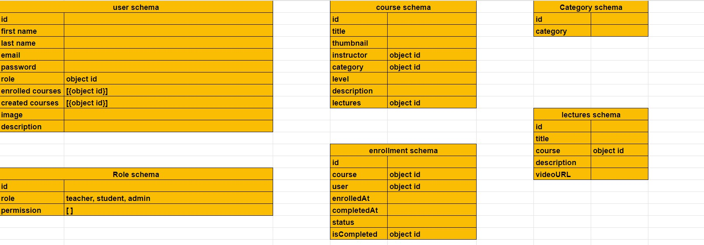

<p align="center">
<a href="https://www.meraki-academy.org" target="_blank" rel="noopener noreferrer">
 
 </a>
</p>

<h3 align="center">Project Title
</h3>

---

<p align="center"> An awesome Project to describe README 
    <br> 
<a href=''>Demo</a>
    <br> 
</p>

## 📝 Table of Contents

- [About](#about)
- [Getting Started](#getting_started)
- [Usage](#usage)
- [Built Using](#built_using)
- [User Story](#user_story)
- [Data Flow](#data_flow)
- [Guided By](#guided_by)

## 🧐 About <a name = "about"></a>

Write about 1-2 paragraphs describing the purpose of your project.

Curious Learner is a non profit organazation that provides a massive open online course (MOOC) platform, dedcated to help students from all over the world to get the knowlage they aspire from the most prestigous and high rated universties for free, such as MIT, Harvard, ..., etc.

in Curious Learner you can register as a student or as a teacher. As a student you can explore the availabe courses, enroll to the ones you have liked for free, watch the lectures, and cancel the enrollment at any time. and as a teacher, you can create courses for your own and, edit them, and delete them, also as a teacher you can enroll to other teacher's courses and watch them as well.

ADMINNNNN


Ex. Are you looking for a quick and easy way to action, action, and action? The **(name of application)** is the greatest and most accurate application to do this for you. It helps you to **(list of activities)**. The **(name of application)** provides a simple design to ensure having the best user experience.

## 🏁 Getting Started <a name = "getting_started"></a>

These instructions will get you a copy of the project up and running on your local machine for development and testing purposes.

### Prerequisites

- Visual Studio Code follow this <a href='https://code.visualstudio.com/download'>link</a> to install.
- Git Bash follow this <a href='https://git-scm.com/downloads'>link</a> to install.
- MongoDB follow this <a href='https://www.mongodb.com/docs/manual/installation/'>link</a> to install.
- Node.js follow this <a href='https://nodejs.org/en/download'>link</a> to install.

### Installing:

1. Clone the repo to your local machine using git bash.

```
git clone https://github.com/C7-ReemMohdMousa/MERAKI_Academy_Project_4.git
```

2. Install packeges repeat this step in backend and frontend folder

```
npm i
```

3. Run server using git bash inside backend folder

```
npm run dev
```

4. Run application using git bash inside frontend folder

```
npm run start
```

Now app ready to use (HOME PAGE SCREEN SHOT)

## 🎈 Usage <a name="usage"></a>

Use this space to show useful examples of how a project can be used. Additional screenshots, code examples and demos work well in this space. You may also link to more resources.

- You have to register to enroll or create courses.
- You can click on the **Explore** tab provided in the navigation bar to view the courses available.
- You can click on the **View course Detalis** button to see the course information; about, instructor, syllabus, the you can enroll to the course by clicking on thr **enroll now** button.
- Once you've enrolled the course, it will appear in your dashboard in **in progress courses** tab, where you can click on **go to course** button to strat watching the lectures, or cancel the enrollment by clicking on **cancel enrollment** button.
- Once you have completed watching the course's lectures, the course automatically will transfer to the completed courses tab.

As a techer you can use the website as a student to watch other instructor's courses, and:
-you can create courses by clicking on **upload a new course now!** button in the dashboard.
- you can Edit course information and delete it as well.
- once you have create the course, you can add you lecture by clicking on **go to course** button to enter the course dashbard and upload lectures by clicking on **upload lecture** button.
- on course dashboard, you can update or edit lectures informations or delete them.


Ex.

- You don't have to register to navigate our web app
- You can click on the **Home** tab provided in the navigation bar to view the home section
- You can click on the **Add to cart** button to add this product to your cart but you have to be one of our users, so you should create an account

## ⛏️ Built Using <a name = "built_using"></a>

- [MongoDB](https://www.mongodb.com/) - Database
- [Express JS](https://expressjs.com/) - Server Framework
- [React JS](https://https://reactjs.org/) - Web Framework
- [Node JS](https://nodejs.org/en/) - Server Environment

## User Story <a name = "#user_story"></a>

Your trello board link
<a href=''>Trello</a>

## Data Flow <a name = "#data_flow"></a>

</a>

## ⚠️ Guided By <a name = "guided_by"></a>

This project is guided by ©️ **[MERAKI Academy](https://www.meraki-academy.org)**
